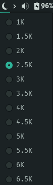

# Night Light

Minimal Linux tray controller for switching Redshift color temperature.



## Requirements

- Linux desktop with StatusNotifierItem tray support
- [Redshift](https://github.com/jonls/redshift)
- Rust toolchain

## Installation

```bash
git clone https://github.com/slava-nikulin/night-light-dialog.git
cd night-light-dialog
cargo install --path .
```

The executable is installed to `~/.cargo/bin/night-light-dialog` by default.

## Autostart

Create:

```text
~/.config/autostart/night-light-dialog.desktop
```

with:

```ini
[Desktop Entry]
Type=Application
Name=Night Light
Exec=/home/USERNAME/.cargo/bin/night-light-dialog
Terminal=false
StartupNotify=false
OnlyShowIn=XFCE;
```

Replace `USERNAME` with your Linux username.

## Presets

Optional custom presets can be placed at:

```text
~/.config/night-light/presets.toml
```

See [`examples/presets.toml`](examples/presets.toml). Without it, built-in presets are used.
