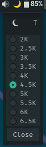

# Night Light Dialog Tool

A GTK4-based tool for managing and switching temperature settings using customizable presets.

## Features
- View and edit Redshift configuration files.
- Manage temperature presets.
- GTK4-based UI.

## Dependencies
- Rust
- GTK4
- glib
- Redshift

## Installation
1. Clone the repository:
   ```bash
   git clone https://github.com/your-username/night-light-diag.git
   cd night-light-diag
   ```
2. Build the project using Cargo:
   ```bash
   cargo build --release
   ```
3. Run the application:
   ```bash
   ./target/release/night-light-diag
   ```

## Usage

### Redshift Configuration
The Redshift configuration file is automatically created at `~/.config/redshift/config`.

[Redshift Configuration Example](examples/redshift_config)

### Presets Configuration
The presets configuration file is located at `~/.config/nighlight/presets.toml`. If the file does not exist, the application will use the following default presets:

- "2K" = 2000
- "2.5K" = 2500
- "3K" = 3000
- "3.5K" = 3500
- "4K" = 4000
- "4.5K" = 4500
- "5K" = 5000
- "5.5K" = 5500
- "6K" = 6000
- "6.5K" = 6500

[Presets Configuration Example](examples/presets.toml)

### Wrapper Script
A wrapper script is provided to launch the application from a panel. The script assumes the project is located at:

```bash
BIN="${BIN:-$HOME/Projects/night-light-dialog/target/release/night-light-dialog}"
```

You should customize the `BIN` variable in the script to point to the correct path of the built binary.

[Wrapper Script Example](examples/wrapper.sh)

## Screenshots


